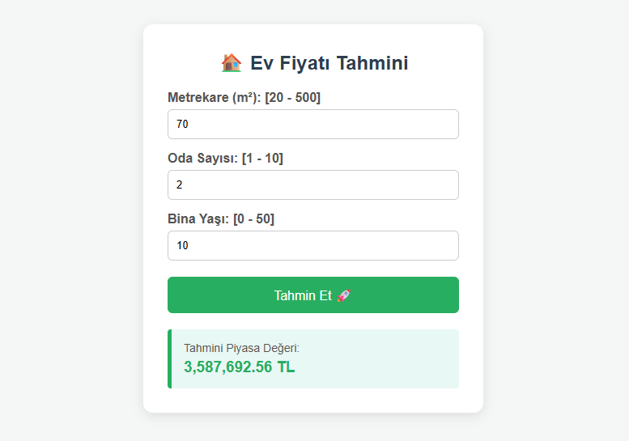

# 🏠 Ev Fiyatı Tahmin Uygulaması (End-to-End ML & FastAPI)

Bu proje, makine öğrenmesi modeli kullanarak ev özelliklerine (Metrekare, Oda Sayısı, Bina Yaşı) göre tahmini piyasa değerini hesaplayan uçtan uca bir web uygulamasıdır.

AI-Assisted Development (Yapay Zeka Destekli Geliştirme) yaklaşımıyla tasarlanmış; model eğitimi, API mimarisi, girdi doğrulama (validation) ve arayüz entegrasyonu süreçleri eşli kodlama (pair programming) ile yürütülmüştür.

---

## 🛠️ Teknolojiler ve Kütüphaneler

* Python 3.12
* Scikit-learn (Linear Regression Modeli)
* Pandas & NumPy (Veri İşleme ve Hazırlık)
* FastAPI (Web API & Arayüz Sunucusu)
* Uvicorn (ASGI Server)
* Joblib (Model Serileştirme / Kaydetme)

---

## 🚀 Öne Çıkan Özellikler

* Yüksek Model Başarısı: Veri seti üzerinde eğitilen Lineer Regresyon modeli ile yüksek başarım (R2 ≈ %97).
* Kullanıcı Dostu Web Arayüzü: Karmaşık API çıktıları yerine sade, hızlı ve kullanıcı odaklı HTML/CSS arayüzü.
* Girdi Doğrulama (Validation): Hatalı veya aşırı uç değerlerin girilmesini hem HTML5 hem de FastAPI arka planında engelleyen güvenlik kuralı.
* Teknik Dokümantasyon: /docs adresi üzerinden erişilebilen otomatik Swagger API dokümantasyonu.

---

## 💻 Kurulum ve Çalıştırma

Projeyi kendi bilgisayarınızda çalıştırıp denemek için şu adımları izleyebilirsiniz:

1. Repoyu Klonlayın:
git clone https://github.com/262yunus/ev-fiyat-tahmini.git
cd ev-fiyat-tahmini

2. Gerekli Kütüphaneleri Yükleyin:
pip install -r requirements.txt

3. Uygulamayı Başlatın:
uvicorn main:app --reload

4. Tarayıcınızda http://127.0.0.1:8000 adresine giderek uygulamayı doğrudan kullanabilirsiniz!

---

## 📸 Uygulama Ekran Görüntüsü

